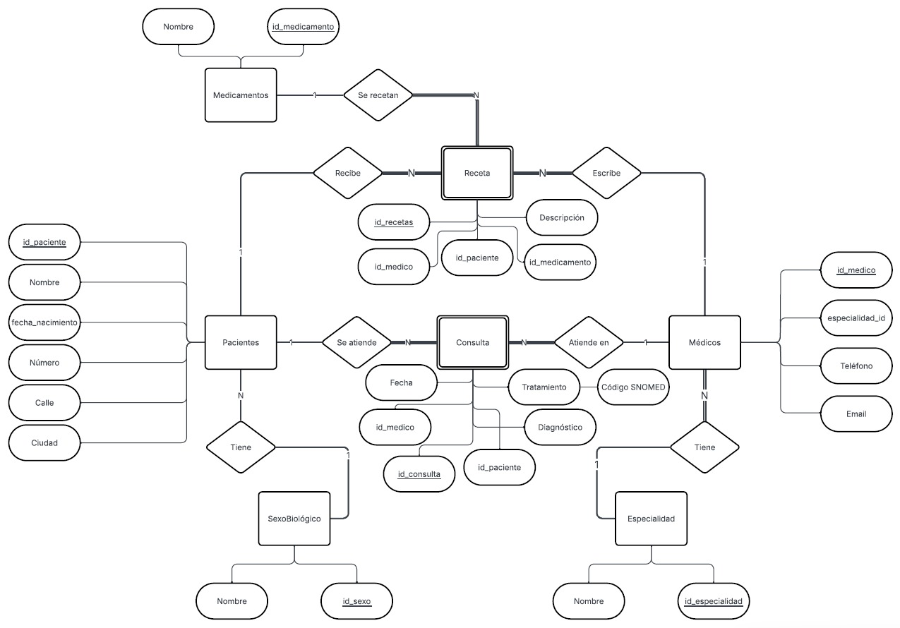
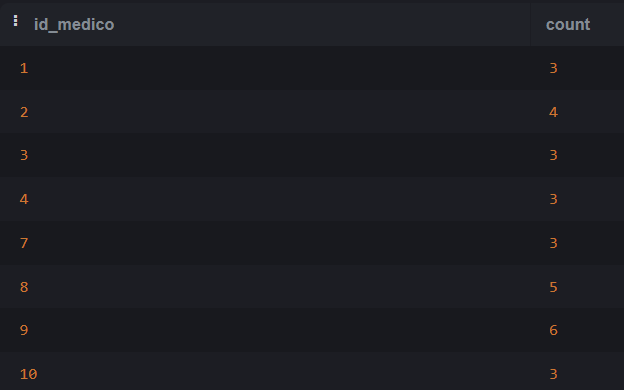
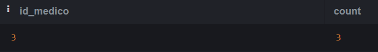
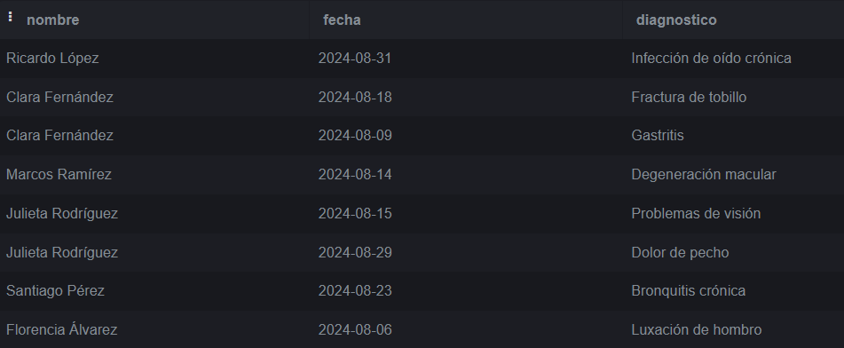
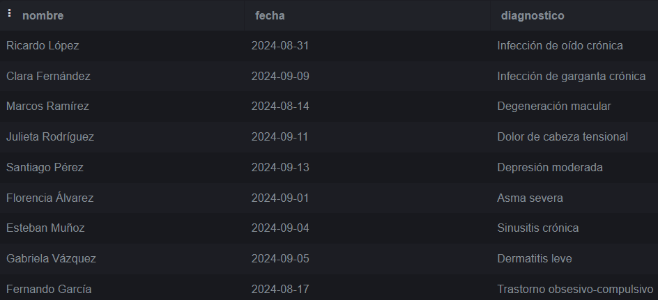
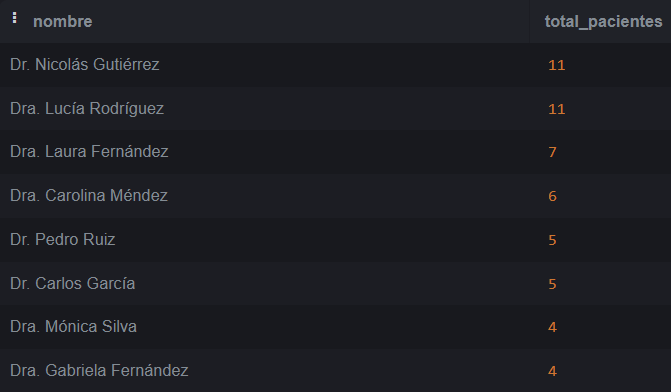

# Trabajo Práctico N°4

## _Autores:_ 
* Juan Manuel Peirano
* Francisco José Barca

## **PARTE 1:** Bases de Datos

### 1. ¿Qué tipo de base de datos es? 
 Es una base de datos relacional porque los datos están organizados de manera estructurada, en tablas, columnas, y estos están relacionados (como se verá en el diagrama entidad-relación). En cuanto a su función definimos que esta sería un data warehouse debido a que los datos almacenados se utilizan para posteriores consultas más complejas (serán utilizados para cálculos estadísticos).

### 2. Armar el diagrama entidad-relación de la base de datos dada. 
 

### 3. Armar el Modelo relacional de la base de datos dada.
 

### 4. Considera que la base de datos está normalizada. En caso que no lo esté, ¿cómo podría hacerlo?

Se puede decir que la base de datos está normalizada en su mayoría, ya que cumple con la Primera, Segunda, y Tercera forma normal.
 La 1ra forma normal indica que todas las tablas contengan valores que estén en su estado más primitivo, es decir, que no se puedan desglosar. Esto se cumple para casi todos los atributos de las distintas entidades/tablas. También todas poseen una clave primaria bien definida.  
 La 2da forma normal establece que además de cumplir con la 1ra forma normal, los atributos no claves deben depender de sus claves primarias, no de una en particular, debido a que si un atributo dependiera de solo una clave primaria habiendo otras más, ese atributo dejaría de tener sentido. Un ejemplo de esto es que en la tabla consultas esté el “id_médico” y el “nombre” del médico, el nombre es un atributo que ya se puede deducir por el id_médico y no tendría sentido dejarlo.  
 Por último, la 3ra forma normal, además de que se deba cumplir la 2da, también exige que los atributos dependen exclusivamente de la clave primaria, y no de atributos no claves, y esto se cumple en su totalidad.

 Bajo el criterio tomado por el grupo se considera que la base de datos está normalizada en su mayoría, dado que se encontraron algunos atributos que podrían dividirse más y estar en un estado más primitivo, como por ejemplo el “nombre” de los pacientes y médicos se los podría dividir en “nombre” y “apellido”. También se encontraron otros atributos tipo string que son de texto libre, como “ciudad” y “diagnóstico”, que pueden indicar lo mismo de distintas maneras. Una manera de evitar este problema sería generando distintas tablas para esos atributos, y asignando un id a cada posibilidad del mismo ( en el caso de ciudades, darle un id a cada ciudad, y para diagnóstico lo mismo).

 Dejando estos casos de lado se puede considerar que la base de datos está bien normalizada.

## **PARTE 2:** Bases de Datos

### 1. Cuando se realizan consultas sobre la tabla paciente agrupando por ciudad los tiempos de respuesta son demasiado largos. Proponer mediante una query SQL una solución a este problema.

CREATE INDEX id_ciudad

ON pacientes (ciudad);

--vista del índice

SELECT indexname, indexdef

FROM pg_indexes

WHERE schemaname = 'public'; 

 

### 2. Se tiene la fecha de nacimiento de los pacientes. Se desea calcular la edad de los pacientes y almacenarla de forma dinámica en el sistema ya que es un valor típicamente consultado, junto con otra información relevante del paciente.
CREATE VIEW vista_edades_pacientes AS  
SELECT EXTRACT(YEAR FROM AGE(CURRENT_DATE, fecha_nacimiento))  
From pacientes;  
 

### 3. La paciente, “Luciana Gómez”, ha cambiado de dirección. Antes vivía en “Avenida Las Heras 121” en “Buenos Aires”, pero ahora vive en “Calle Corrientes 500” en “Buenos Aires”. Actualizar la dirección de este paciente en la base de datos.
UPDATE pacientes  
SET calle = 'Corrientes',  
numero = 500  
WHERE id_paciente = 1;  
 

### 4. Seleccionar el nombre y la matrícula de cada médico cuya especialidad sea identificada por el id 4
SELECT NOMBRE, matricula  
FROM medicos  
WHERE especialidad_id = 4;  
 

### 5. Puede pasar que haya inconsistencias en la forma en la que están escritos los nombres de las ciudades, ¿cómo se corrige esto? Agregar la query correspondiente.
UPDATE pacientes  
SET ciudad = 'Buenos Aires'  
where ciudad ILIKE '%buenos aires%' OR ciudad ilike '%bs aires%' OR ciudad ilike '%buenos aiers%' OR ciudad ilike '%buenos%aires%';

UPDATE pacientes  
SET ciudad = 'Córdoba'  
where ciudad ILIKE '%Cordoba%' or ciudad ILIKE '%Córodba%' or ciudad ILIKE '%Corodba%';  

UPDATE pacientes  
SET ciudad = 'Mendoza'  
where ciudad ILIKE '%Mendzoa%';  
 

### 6. Obtener el nombre y la dirección de los pacientes que viven en Buenos Aires.
SELECT nombre, calle, numero, ciudad  
FROM pacientes  
WHERE ciudad ILIKE '%buenos aires%';  
 

### 7. Cantidad de pacientes que viven en cada ciudad.
SELECT ciudad, COUNT(pacientes)  
FROM PACIENTES   
GROUP BY ciudad  
order by ciudad;  

### 8. Cantidad de pacientes por sexo que viven en cada ciudad.
SELECT ciudad, id_sexo, COUNT(pacientes)  
FROM PACIENTES  
GROUP BY ciudad, id_sexo  
order by ciudad;  

### 9. Obtener la cantidad de recetas emitidas por cada médico.
select id_medico, count(recetas)  
from recetas  
group by id_medico  
order by id_medico;  

### 10. Obtener todas las consultas médicas realizadas por el médico con ID igual a 3 durante el mes de agosto de 2024.
SELECT id_medico, COUNT(CONSULTAS)  
FROM consultas  
WHERE ID_MEDICO = 3 AND fecha >= '2024-08-01'AND fecha < '2024-09-01'  
GROUP BY id_medico;  

### 11. Obtener el nombre de los pacientes junto con la fecha y el diagnóstico de todas las consultas médicas realizadas en agosto del 2024.
SELECT pacientes.nombre, consultas.fecha, consultas.diagnostico  
FROM consultas  
INNER JOIN pacientes  
ON consultas.id_paciente = pacientes.id_paciente  
WHERE fecha >= '2024-08-01'AND fecha < '2024-09-01'  
ORDER BY consultas.id_paciente;  

### 12. Obtener el nombre de los medicamentos prescritos más de una vez por el médico con ID igual a 2.
SELECT medicamentos.nombre, COUNT(*) AS veces_prescrito  
FROM recetas  
INNER JOIN medicamentos  
ON recetas.id_medicamento = medicamentos.id_medicamento  
WHERE recetas.id_medico = 2  
GROUP BY medicamentos.nombre  
HAVING COUNT(*) > 1;  

### 13. Obtener el nombre de los pacientes junto con la cantidad total de recetas que han recibido.
select pacientes.nombre, count(*) as cantidad_recetas  
from recetas  
inner join pacientes  
on recetas.id_paciente = pacientes.id_paciente  
group by pacientes.nombre;  

### 14. Obtener el nombre del medicamento más recetado junto con la cantidad de recetas emitidas para ese medicamento.
SELECT medicamentos.nombre, COUNT(*) AS veces_prescrito  
FROM recetas  
INNER JOIN medicamentos   
ON recetas.id_medicamento = medicamentos.id_medicamento  
GROUP BY medicamentos.nombre  
--Ordeno descendentemente y le pido que me de el primer valor  
ORDER BY veces_prescrito DESC  
LIMIT 1;  

### 15. Obtener el nombre del paciente junto con la fecha de su última consulta y el diagnóstico asociado.
SELECT nombre, fecha, diagnostico  
FROM (  
  SELECT   
    pacientes.nombre,  
    consultas.fecha,  
    consultas.diagnostico,  
    ROW_NUMBER() OVER (  
      PARTITION BY consultas.id_paciente        -- agrupa por paciente  
      ORDER BY consultas.fecha DESC             -- ordena por fecha más reciente  
    ) AS rn  
  FROM consultas  
  INNER JOIN pacientes  
    ON consultas.id_paciente = pacientes.id_paciente  
) AS sub  
WHERE rn = 1;  --selecciona solo la fila con la fecha más reciente de cada paciente  

### 16. Obtener el nombre del médico junto con el nombre del paciente y el número total deconsultas realizadas por cada médico para cada paciente, ordenado por médico y paciente.
SELECT medicos.nombre, pacientes.nombre, count(*)  
from consultas  
INNER JOIN medicos  
ON consultas.id_medico = medicos.id_medico  
INNER JOIN pacientes  
ON consultas.id_paciente = pacientes.id_paciente  
GROUP BY medicos.nombre, pacientes.nombre  
ORDER BY medicos.nombre, pacientes.nombre;  

### 17. Obtener el nombre del medicamento junto con el total de recetas prescritas para ese medicamento, el nombre del médico que lo recetó y el nombre del paciente al que se le recetó, ordenado por total de recetas en orden descendente.
SELECT medicamentos.nombre, medicos.nombre, pacientes.nombre, count(*) as total  
FROM recetas  
INNER JOIN medicamentos   
ON recetas.id_medicamento = medicamentos.id_medicamento  
INNER JOIN medicos  
ON recetas.id_medico = medicos.id_medico  
INNER JOIN pacientes  
ON recetas.id_paciente = pacientes.id_paciente  
GROUP BY medicamentos.nombre, medicos.nombre, pacientes.nombre  
ORDER BY total DESC;  

### 18. Obtener el nombre del médico junto con el total de pacientes a los que ha atendido, ordenado por el total de pacientes en orden descendente.
SELECT medicos.nombre, count(distinct consultas.id_paciente) as total_pacientes  
FROM consultas  
INNER JOIN medicos  
ON consultas.id_medico = medicos.id_medico  
GROUP BY medicos.nombre  
ORDER BY total_pacientes desc;   

